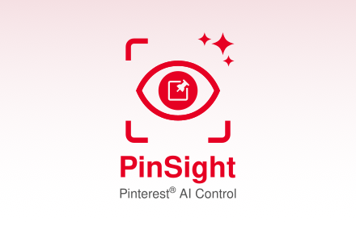

# PinSight Chrome Extension

Hello ! This is the repository for the PinSight browser extension.

## What is it for ?

I was recently browsing Pinterest, and couln't help but notice the huge amount of AI content I was presented with. I also noticed that there is no way of knowing if a pin is AI or not without accessing it's page first, and you can't filter out AI pins in the feed either.
This is why I decided to make a browser extension to solve the issue. 

So instead of you having to manually check each pin, PinSight does the checking for you and lets you choose how AI pins are displayed :
  - Hide them completely
  - Blur them (with the option to reveal)
  - Label them (small badgeq are added on the images)

I made this mostly as a personal project and learning experience, but I found out that a lot of people online seemed annoyed by the same thing so I'm making it available to everyone in hopes that it will help others.

## Use locally

[CRXJS](https://github.com/crxjs/chrome-extension-tools/blob/main/README.md) was used for this project. If you want to contribute or just develop and run the extension on your machine, you can just clone the repo, then install packages with
```shell
npm install
```

and run the developpement server (Vite)
```shell
npm run dev
```

For more in-depth information on how to test the extension while developing or any other CRXJS related question, [their docs](https://crxjs.dev/guide/installation/create-crxjs) are great.

Thank you for stopping by! :)
